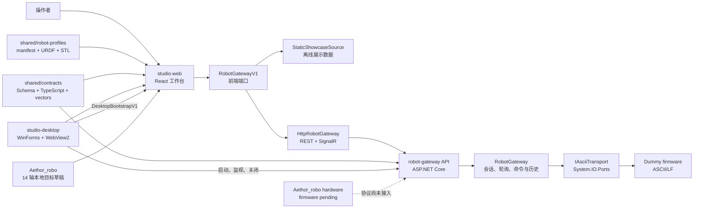
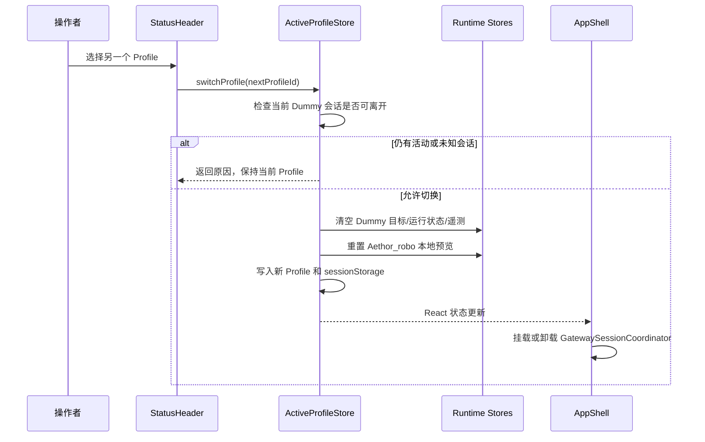
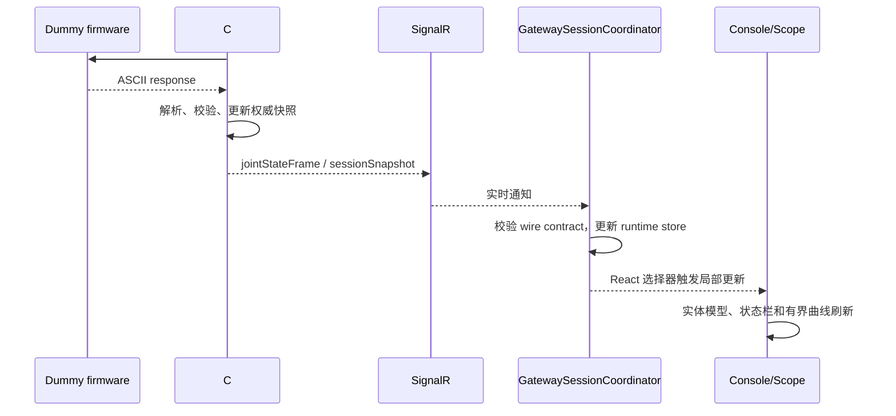

# Aethor Studio V2 系统工程说明

| 项目 | 内容 |
|---|---|
| 产品 | Aethor Studio V2 |
| 当前版本 | 0.1.0 |
| 目标平台 | Windows 10/11，桌面端优先 |
| 文档版本 | 2026-08-11 |
| 适用对象 | 前端、后端、机器人协议、测试与交付工程师 |

## 1. 文档目的

本文说明 Aethor Studio V2 的工程组织、运行时组成、前后端技术路线、机器人切换、网关适配和通信流程。它面向首次接手项目的工程师，用于回答以下问题：

- 代码分别放在哪里，各目录由谁负责；
- Web 前端、C# 网关和 Windows 桌面壳如何协作；
- Dummy 与 Aethor_robo 如何共用一套工作台，又如何隔离各自状态；
- 浏览器展示模式和真实网关模式如何切换；
- 前端、网关、串口和固件之间如何传递状态与命令；
- 新增机器人或协议适配器时应从哪一层开始。

具体字段、协议帧和阶段验收以文末列出的权威文档为准。本文负责解释系统关系，不重复维护完整 Schema 或固件协议表。

文中有两种容易混淆的“切换”：一是 `Dummy / Aethor_robo` 的 Profile 切换，决定当前工作台操作哪一类机器人；二是 `StaticShowcaseSource / HttpRobotGateway` 的网关实现选择，决定 Dummy 页面从展示源还是本机 C# 网关取得数据。前者可由操作者在顶栏完成，后者在应用启动时由桌面 bootstrap 或开发环境配置决定，不是页面上的即时开关。

## 2. 产品组成

Aethor Studio V2 是一个多机器人调试工作台。当前纳入工程的设备有两类：

| Profile | 界面名称 | 构型 | 当前接入程度 |
|---|---|---:|---|
| `dummy-6dof` | Dummy | 单机械臂，6 轴 | 模型、串口枚举、会话、反馈、终端、结构化命令网关已接入；动作编排目前为离线编辑 |
| `aethor-robo-dual-7dof` | Aethor_robo | 空间机器人，左、右机械臂各 7 轴 | 部署版本体/双臂模型和 14 轴本地 FK 预览已接入；独立动量轮链路不进入 Profile；固件协议与硬件网关待后续实现 |

主界面包含五个工作区：

| 路由 | 工作区 | 适用 Profile | 主要职责 |
|---|---|---|---|
| `/console` | 控制台 | Dummy、Aethor_robo | 三维模型、实体反馈、目标幽灵、关节编辑和当前事件 |
| `/scope` | 数据示波 | Dummy | 关节角、目标值、误差及运行信号的有界曲线观察 |
| `/terminal` | 串口终端 | Dummy、Aethor_robo | Dummy TX/RX 调试；Aethor 候选协议模板与本地校验（adapter 完成前禁用发送） |
| `/devices` | 设备与模型 | Dummy、Aethor_robo | Profile、串口、会话、URDF、关节映射和能力信息 |
| `/actions` | 动作编排 | Dummy | 动作程序的离线编辑、导入、导出和目标预览 |

旧路径 `/twin` 只保留到 `/console` 的兼容重定向，不再作为正式路由使用。进入当前 Profile 不支持的示波或动作工作区时，`ProfileWorkspaceGate` 显示能力说明和切换入口。终端本身支持双 Profile，但在页面内部按 adapter capability 分流，不会把 Dummy 帧或发送能力套用到 Aethor_robo。

## 3. 总体架构

系统由 Web 前端、共享契约与 Profile、C# 机器人网关、Windows 桌面壳四部分组成。



这里有三个重要的所有权关系：

1. 前端负责界面、目标草稿、可视化和用户交互，不直接持有串口。
2. C# `RobotGateway` 负责唯一串口会话、查询循环、命令仲裁、最新快照和有界历史。
3. 桌面壳负责窗口和子进程生命周期，不保存机器人业务状态。

当前所谓“后端”特指运行在本机 loopback 上的机器人网关。工程没有数据库、用户中心、云端 API 或远程设备服务；Profile 和模型是版本化文件，设备 session、最新反馈和审计历史保存在网关进程内存中，窗口与显示偏好保存在当前 Windows 用户的应用数据目录。

## 4. 工程目录

仓库采用 pnpm workspace 管理前端和共享 TypeScript 包，同时在同一根目录管理 .NET 解决方案。

```text
Aethor_StudioV2/
├─ apps/
│  ├─ studio-web/                 React/Vite 前端
│  │  ├─ public/                  品牌和 Web 静态资源
│  │  ├─ src/
│  │  │  ├─ app/                  路由、AppShell 和页面元数据
│  │  │  ├─ components/           导航、状态、3D 和通用组件
│  │  │  ├─ contracts/            前端内部视图契约
│  │  │  ├─ domain/               Profile、信号、动作等纯业务逻辑
│  │  │  ├─ fixtures/             明确标记的展示样本
│  │  │  ├─ hooks/                可复用 React hooks
│  │  │  ├─ integrations/         网关、桌面桥、导入导出等适配器
│  │  │  ├─ pages/                五个工作区页面
│  │  │  ├─ profile/              内置 Profile 的前端装载入口
│  │  │  ├─ stores/               Zustand 会话和草稿状态
│  │  │  └─ styles/               token、全局样式和响应式布局
│  │  └─ tests/e2e/               Playwright 端到端验收
│  └─ studio-desktop/             WinForms/WebView2 桌面宿主
│     ├─ assets/                   图标等桌面资源
│     ├─ src/                      桌面应用源码
│     ├─ tests/                    桌面宿主单元测试
│     ├─ scripts/                  发布清单和依赖治理脚本
│     └─ legal/                    发布包法律材料输入
├─ services/
│  └─ robot-gateway/
│     ├─ src/
│     │  ├─ AethorStudioV2.Domain/
│     │  ├─ AethorStudioV2.Application/
│     │  ├─ AethorStudioV2.Infrastructure/
│     │  └─ AethorStudioV2.Api/
│     ├─ tests/                    C# 单元与集成测试
│     └─ *.ps1                     构建、预检、smoke 和长测入口
├─ shared/
│  ├─ contracts/                  JSON Schema、TS 类型、协议函数和测试向量
│  └─ robot-profiles/
│     ├─ BuiltIn/dummy-6dof/
│     ├─ BuiltIn/aethor-robo-dual-7dof/
│     └─ verify-provenance.mjs     内置模型来源和资产完整性检查
├─ docs/
│  ├─ decisions/                  架构决策记录
│  ├─ handoffs/                   阶段交接文档
│  ├─ interfaces/                 专项接口说明
│  ├─ profiles/                   机器人档案
│  ├─ prompts/                    阶段执行提示词
│  ├─ protocols/                  固件协议事实
│  ├─ runbooks/                   运行、诊断和现场步骤
│  └─ testing/                    验收矩阵
├─ .codex/                        本项目工程工作流 Skill
├─ AGENTS.md                      仓库级协作约定
├─ package.json                   根命令入口
├─ pnpm-workspace.yaml            workspace 边界
├─ pnpm-lock.yaml                 唯一 Node 依赖锁文件
└─ global.json                    .NET SDK 版本约束
```

`artifacts/`、`TestResults/`、`dist/`、`bin/`、`obj/`、Playwright 报告和日志属于生成内容，不作为手工维护的源码，也不进入 Git 交付。

### 4.1 目录依赖方向

前端页面可以依赖组件、store、domain、integration 和 `shared/contracts`；页面不能绕过 integration 直接访问 HTTP 或 SignalR。C# 依赖方向保持为：

```text
Api -> Application -> Domain
Api -> Infrastructure -> Application/Domain
```

`Domain` 不引用 ASP.NET Core、串口或 UI；`Infrastructure` 实现 Application 定义的端口；`Api` 只做宿主装配、认证、路由和 wire model 转换。

## 5. 前端技术栈

### 5.1 基础框架

前端开发基线为 Node.js 24.x 和 pnpm 11.16.0，依赖版本由根 `pnpm-lock.yaml` 统一锁定。

| 技术 | 当前版本 | 用途 |
|---|---:|---|
| React | 19.2.8 | 页面与组件运行时 |
| TypeScript | 7.0.2 | strict 类型检查和跨层类型约束 |
| Vite | 8.2.1 | 开发服务器、生产构建和资源处理 |
| React Router | 7.18.2 | 五个工作区路由和 URL 状态 |
| Zustand | 5.0.14 | 会话状态、目标草稿和界面偏好 |
| Zod | 4.4.3 | 前端运行时响应和导入数据校验 |
| Microsoft SignalR Client | 10.0.11 | 接收本机网关的 session、关节和协议通知 |

前端采用函数组件和按路由懒加载。应用外壳 `AppShell` 长驻，页面在工作区内切换，因此导航不会重复创建全局网关协调器。

### 5.2 三维与数据可视化

| 技术 | 当前版本 | 用途 |
|---|---:|---|
| Three.js | 0.182.0 | 三维场景、材质、坐标系和资源释放 |
| React Three Fiber | 9.7.0 | Three.js 的 React 渲染层 |
| urdf-loader | 0.13.1 | URDF、关节和 STL 资源装载 |
| ECharts | 6.1.0 | 数据示波、缩放、游标和多单位坐标轴 |

控制台为实体模型和目标幽灵模型建立独立对象树。关节编辑只更新目标草稿；Dummy 的实测帧只更新实体模型。Aethor_robo 当前没有实测通道，左右臂共用一个 14 轴本地预览 store。

三维场景使用按需渲染。静止时不保持永久动画循环；相机、关节、工具窗和模型状态变化时显式请求新帧。画布根据显示面积和设备 DPR 调整实际栅格密度，并对 framebuffer 像素数量设置上限，避免高分屏无意义放大 GPU 开销。

### 5.3 组件与样式

- Radix Select/Tooltip 提供无样式交互原语，业务视觉由项目 CSS 控制；
- Lucide React 提供统一线性图标；
- `tokens.css` 管理颜色、字号、间距、分隔线和响应式标尺；
- 主字体为 `Inter, system-ui, -apple-system, BlinkMacSystemFont, "Segoe UI", sans-serif`，数值和协议使用 `Cascadia Mono`；
- 不依赖在线字体，不使用 Ant Design 的后台模板样式。

### 5.4 校验与测试

| 技术 | 用途 |
|---|---|
| Vitest 4.1.10 | domain、store、integration 和组件单元测试 |
| Testing Library | 按用户行为测试组件状态和交互 |
| Playwright 1.62.1 | 1366×768、1920×1080、2560×1440 三档生产构建验收 |
| fflate 0.8.3 | `.aethor-robot` ZIP 的前端读取与有界校验 |

## 6. C# 网关与桌面端技术栈

### 6.1 机器人网关

网关使用 .NET SDK 10.0.302，目标运行时为 .NET 10。

| 技术 | 用途 |
|---|---|
| ASP.NET Core Minimal API | loopback REST 接口、依赖注入和宿主生命周期 |
| ASP.NET Core SignalR | session、关节、协议帧和命令结果通知 |
| System.IO.Ports 10.0.0 | Windows COM 端口枚举与串口连接 |
| System.Text.Json | wire model 序列化，统一 camelCase 和枚举格式 |
| xUnit/.NET Test SDK | Domain、Application、Infrastructure 和 API 回归测试 |

C# 工程按四层划分：

| 层 | 职责 | 不负责的内容 |
|---|---|---|
| Domain | 协议解析、格式化、值对象、状态转换和约束 | HTTP、SignalR、串口句柄、窗口 |
| Application | `RobotGateway`、会话、轮询、命令仲裁、审计和动作执行内核 | 具体 COM 实现、页面展示 |
| Infrastructure | `SerialPort`、端口目录和 Application 端口实现 | HTTP 路由、界面状态 |
| Api | REST、SignalR、令牌校验、配置和进程宿主 | 机器人目标草稿、三维模型 |

### 6.2 Windows 桌面壳

桌面端是 `net10.0-windows` WinForms 应用，使用 Microsoft WebView2 1.0.4129.50 承载已构建的 Web 前端。它提供：

- 自定义窗口、Per-Monitor V2 DPI、单实例和窗口位置恢复；
- 启动并监视本次桌面会话专属的 C# 网关子进程；
- 生成随机 loopback 端口和短期 session token；
- 在 Web 脚本执行前注入 `DesktopBootstrapV1`；
- 处理最小化、最大化、恢复、关闭和诊断包导出等 `DesktopBridgeV1` 消息；
- 关闭时请求网关收束会话，再回收 WebView2、子进程和 Job Object；
- 有界日志、Web 操作探针和低频运行时性能采样。

桌面壳不复制 Web 页面，也不维护另一套机器人状态。桌面版与浏览器版共用同一份 `studio-web` 构建结果，差别仅在宿主能力和网关配置来源。

## 7. Dummy 与 Aethor_robo 的切换实现

### 7.1 全局 Profile 与局部机械臂组

顶栏 `Current profile` 是整台机器人级别的选择器：

- 选择 `Dummy`，当前上下文是一台六轴机械臂；
- 选择 `Aethor_robo`，当前上下文是一台包含左、右两组七轴机械臂的空间机器人。

Aethor_robo 页面中的 `left-arm / right-arm` 只是在同一 Profile 内切换当前编辑组和相机取景，不会创建第二个设备会话，也不会改变全局 Profile。

### 7.2 切换流程

Profile 状态由 `useActiveRobotProfileStore` 统一管理，稳定键为 `aethor.active-profile.v1`。切换过程如下：



离开 Dummy 前会检查串口会话、命令结果和电机状态。切换成功后，隐藏页面留下的目标值、遥测和运行时状态不会进入另一台机器人。

`AppShell` 只在 Dummy 激活时挂载一个 `GatewaySessionCoordinator`。因此路由切换不会产生多条 SignalR 连接，切换到 Aethor_robo 后也不会把 Dummy 反馈解释为 Aethor_robo 数据。

### 7.3 初始 Profile

- 普通浏览器会话默认进入 Aethor_robo；同一标签会话可从版本化 `sessionStorage` 恢复上次选择。
- 桌面壳提供 Dummy 子网关时，新桌面会话固定从 Dummy 启动，以便端口目录和网关状态立即落在正确的 Profile 上。
- Aethor_robo 暂不创建网关会话；其控制台保持本地模型预览。

### 7.4 工作区能力处理

共享工作区先读取当前 Profile 的 capability，再决定显示真实功能、只读信息或能力提示。控制台和设备页有两套 Profile 视图；示波、终端和动作编排由路由 gate 限定为 Dummy。Dummy 专属的串口、终端和动作能力不会被自动映射给 Aethor_robo。后续 Aethor_robo 接入时应新增独立 adapter 和能力声明，而不是在页面中散落 `if profileId` 的协议分支。

## 8. 前端网关机制

### 8.1 `RobotGatewayV1` 端口

页面依赖 `RobotGatewayV1` TypeScript 接口，不依赖某个具体传输。端口覆盖四类操作：

1. 能力与端口：读取 capabilities、枚举串口；
2. 会话与快照：连接、断开、读取 session、关节状态和历史；
3. 实时通知：建立和关闭 telemetry；
4. 命令：使能、停止并去使能、模式、关节组和受限 engineering direct。

目前有两个实现：

| 实现 | 使用场景 | 行为 |
|---|---|---|
| `StaticShowcaseSource` | 未配置网关的浏览器、E2E 展示模式 | 提供有限展示数据；连接和硬件命令返回不可用 |
| `HttpRobotGateway` | 桌面子网关或显式开发网关 | 使用 loopback REST、SignalR 和 session token |

页面只看端口能力，因此切换数据源不需要改页面组件。

### 8.2 网关实现选择

`createRobotGateway()` 按以下优先级建立实例：

1. 如果检测到有效 `DesktopBootstrapV1`，完全采用桌面壳给出的网关 URL 和 token；其中显式 `gateway: null` 表示离线桌面，不再读取开发环境变量。
2. 浏览器开发模式读取 `VITE_AETHOR_GATEWAY_URL` 与 `VITE_AETHOR_GATEWAY_SESSION_TOKEN`，两项必须同时存在。
3. 没有完整配置或配置校验失败时使用 `StaticShowcaseSource`。

`HttpRobotGateway` 只接受 loopback 地址和长度合规的 token。开发环境变量只用于本机开发，不写入仓库，不进入发布包。该实例在前端模块初始化时创建；运行中切换 Profile 只控制是否挂载 Dummy 的会话协调器，不会在同一页面进程里热替换网关实现。要改变网关来源，应由新的桌面 bootstrap 或新的开发启动配置重新建立页面上下文。

### 8.3 C# 网关进程

桌面模式下，每个桌面会话只有一个自有网关子进程。桌面壳为它选择随机 loopback 端口、生成 token、设置命令策略，等待 `/health/ready` 后再向 Web 前端提供 bootstrap。第二次启动桌面程序只激活现有窗口，不会再创建一套网关。

浏览器工程调试模式使用仓库脚本启动本机网关和前端。两种模式都不会因为页面加载而自动打开 COM 口；端口由用户枚举、选择并显式连接。

## 9. 通信机制

### 9.1 前端与网关：REST

REST 用于权威快照、端口操作和命令请求。主要接口为：

| Method | Path | 用途 |
|---|---|---|
| `GET` | `/health/live`、`/health/ready` | 进程存活和宿主就绪 |
| `GET` | `/api/v1/gateway/capabilities` | 协议版本、命令策略和能力协商 |
| `GET` | `/api/v1/serial/ports` | 枚举 COM 口，不打开端口 |
| `GET` | `/api/v1/session` | 当前会话快照 |
| `GET` | `/api/v1/joint-state` | 最新关节反馈 |
| `GET` | `/api/v1/protocol-frames` | 有界 TX/RX/错误历史 |
| `GET` | `/api/v1/commands` | 有界命令审计 |
| `POST` | `/api/v1/session/connect`、`disconnect` | 显式建立或释放串口会话 |
| `POST` | `/api/v1/commands/*` | 结构化机器人命令 |
| `POST` | `/api/v1/engineering/direct-command` | 开发模式下的 Dummy 单行白名单 |
| `POST` | `/api/v1/host/shutdown` | 桌面宿主请求网关正常退出 |

所有 `/api/v1/*` 请求携带 `X-Aethor-Session`。端口刷新、连接和断开另带 `X-Aethor-Operation`，用于将前端点击、Web 请求和网关日志串成同一次操作。

端口目录和串口会话动作在前端有 single-flight owner：同一时刻只执行一个操作；重复的相同意图共享请求，不同意图等待当前操作收束后再处理，避免快速点击造成连接/断开交叉。

### 9.2 网关到前端：SignalR

SignalR Hub 为 `/hubs/robot-v1`，使用 Bearer token。服务端发送四类事件：

| 事件 | 内容 | 前端处理 |
|---|---|---|
| `sessionSnapshot` | 连接、使能、模式、来源和有效性 | 更新全局会话状态 |
| `jointStateFrame` | 六轴实测角、序号和时间 | 更新实体模型并写入有界示波缓冲 |
| `protocolFrame` | TX/RX/错误分类 | 更新终端与最近事件 |
| `commandResult` | 命令状态变化 | 触发命令历史恢复并更新操作结果 |

SignalR 负责及时通知，REST 负责恢复完整事实。实时通道重连后，前端重新读取 capabilities、session、joint state 和历史；仅收到“已重连”事件本身不足以恢复页面状态。

服务端事件队列和前端历史都有容量上限。中间通知可以被丢弃，最新快照和命令审计仍可通过 REST 重建。

### 9.3 网关与 Dummy：串口

Dummy 当前使用 `dummy-ascii-v1` 适配器：

- 115200 baud，8 data bits，no parity，1 stop bit；
- ASCII 按行处理，V2 发送 LF；
- no handshake，DTR/RTS 关闭；
- `#GETJPOS` 默认按 25 ms 固定周期请求；模式和使能在位置样本之间每 250 ms 交替查询一项，因此各自约 500 ms 刷新。连接启动和超时恢复通过两个相邻位置周期补齐模式与使能，不连续发出三条查询；滑条、反馈、动作点位和命令统一保存设备角，只有 3D 渲染按 Profile 换算模型角（Dummy J3 为 `model=device-90°`）；
- 每次只由 C# 网关持有一个 `SerialPort`；
- 输入经过分片、粘包、非 ASCII、超长行和未知帧分类后再进入状态机。

串口成功打开后，session 先进入 `connected + stale`。只有取得完整、合法的查询结果后，反馈才进入 `measured + valid`。普通打开失败会释放临时 transport、保留关联错误并把 session 恢复为 `offline`，不会要求操作者额外断开，也不会阻塞桌面关闭。打开过程本身默认最多等待 5 秒；该值可在 `100–30000 ms` 内由宿主配置。如果驱动打开停滞或请求被取消，adapter 会主动 dispose 尚未接管的候选连接，网关记录 `serial.open.timeout/cancelled` 并禁止本进程继续尝试，必须重启 Gateway 后再连接，避免重复点击累积不可取消的原生任务。成功打开后的读取超时、拔线或 I/O 故障才进入 `faulted` 并释放 transport。系统不会自动换端口或自动重连。

具体命令、回包和完成语义见 [Dummy ASCII v1](protocols/dummy-ascii-v1.md)。Aethor_robo 尚无可执行串口 adapter，后续不能直接复用 Dummy formatter。

Application 层的 `SerialDuplexScheduler` 已接入 Dummy 生产网关：它对一个已打开 transport 建立唯一持续 reader、唯一 writer、RX 有界队列和 P0–P3 有界发送队列。非安全工作不能占用安全预留槽；满载时安全工作可以淘汰最早的低优先级项；每项工作有排队时效和独立完成 ticket。读取、写入或 handler 故障会停止 session 并关闭 transport，避免不可取消的原生 I/O 阻塞退出。只有 Dummy adapter 明确标记的幂等只读查询可在 Windows error 121 或写超时后延迟 100 ms 重试一次，动作和状态改变命令从不自动重发。探针可读取队列深度、接受/拒绝/写入/重试/过期/淘汰/失败计数和最后故障，不包含 payload。

`DummySerialSession` 位于协议层和调度器之间，拥有唯一 Dummy decoder。结构化查询与命令使用单一 response fence 关联无标签回包；终端 direct 只排队写入，不创建响应 waiter。旧 `serialIoGate` 和直接串口读写已经删除，因此不会出现两个 reader 竞争回包。A1-H0 已加入无状态 Aethor TypeScript/C# codec 和主机侧 CRC vectors，但没有注册 transport 或请求等待；固件侧向量可追溯后再添加独立 request/session registry。

### 9.4 关节反馈流程



新 Dummy 会话的第一帧可信实测关节角可一次性建立目标幽灵的初始基准。之后实测反馈只更新实体模型，不覆盖用户已经编辑的目标草稿。

两种轮询节拍并不代表两条串口线程。所有 RX 都由 `DummySerialSession` 的唯一 reader 解码；所有 TX 都进入唯一优先级 writer。位置查询为 P2，普通结构化命令与 direct 为 P1，STOP/DISABLE 为 P0。位置周期按起点计时，串口往返耗时不会在周期后再次叠加；结构化问答的 response fence 会阻止普通写入串入无标签回包窗口，但 P0 可以有界抢占。首次连接和任何超时恢复都必须重新完成一次位置、模式、使能的完整状态周期；其中任一项失败时，页面保持 stale，不把局部成功解释为设备可控。

### 9.5 命令流程

结构化命令从 UI 产生 DTO，经前端能力和状态检查后提交 REST。C# 网关再次验证 Profile、session、命令参数和当前设备状态，然后通过唯一串口所有权写入固件。命令结果进入审计历史，并通过 HTTP 响应与 SignalR 变化通知返回前端。终端 direct 使用另一条结果流：HTTP 入队返回 `queued`，物理写入后发布 `sent`，请求之间不等待设备回包；前端按 request ID 合并有界历史。

```text
目标草稿
  -> 前端格式/限位/能力检查
  -> RobotGatewayV1
  -> REST command endpoint
  -> C# 命令仲裁与幂等检查
  -> Dummy ASCII formatter
  -> SerialPort
  -> 固件回包与后续实测查询
  -> CommandResult / CommandAuditRecord
```

`accepted` 或 FIFO 数字只表示网关或固件队列接收。需要物理完成证据的结构化命令由网关继续读取关节反馈并按完成策略收束。当前结构化关节组能力只有在速度、到位容差、稳定窗口和总超时四项配置完整时才会对 UI 开放。

开发模式另有受限 direct command，但仍经过 C# 白名单、会话状态、限位、速度和串口所有权检查；它不是浏览器直接写串口的旁路。HTTP 入队后返回 `QUEUED · GATEWAY ACCEPTED`，物理写入后再发布 `SENT · MANUAL CONFIRM`；两阶段都不等待 FIFO、最终 `ok` 或到位，也不阻止下一次人工目标。迟到回包只保留为日志，`#GETJPOS` 暂停时页面保留最后值并标为 stale。即使 `#GETJPOS` 持续回包，写入后至少 500 ms、至少 8 帧完全不动且仍远离目标时，网关也会把关节反馈降为 stale；任一关节重新变化后自动恢复。该判断只说明固件公布的角度没有进展，不能判断实机是否运动；这套人工确认语义不适用于正式结构化动作执行。

## 10. 状态所有权与生命周期

| 状态 | 所有者 | 生命周期与清理 |
|---|---|---|
| 当前 Profile | `useActiveRobotProfileStore` | 当前前端会话；切换时清理机器人临时状态 |
| Dummy 目标关节角 | `useRobotSessionStore` | 前端会话草稿；与反馈分离 |
| Aethor_robo 14 轴目标 | `useAethorRoboConsoleStore` | 前端会话本地预览；切换 Profile 时重置 |
| 端口列表和当前选中端口 | 前端 runtime store | 当前 Dummy 会话；可重新枚举，断开后回到初始状态 |
| 串口句柄 | C# `RobotGateway` / Infrastructure | 从显式连接到断开或故障清理 |
| session、motor、mode、最新反馈 | C# `RobotGateway` | 当前唯一设备会话；REST 为权威快照 |
| 协议帧和命令审计 | C# 有界历史，前端保存视图副本 | 新 session 或断开时清理 |
| 示波历史 | 前端 `LiveSignalHistory` | 当前 measured session；按时间和条数有界 |
| 动作编辑草稿 | `useActionProgramStore` | 当前编辑会话；只有显式保存才进入本地持久层 |
| 工具窗布局和显示偏好 | 版本化 local storage | 当前 Windows 用户 |
| 窗口位置、日志、WebView 数据 | 桌面壳应用数据目录 | 跨启动保存，按各自规则轮转或恢复 |
| 展示数据 | `StaticShowcaseSource` | 无网关时使用，不改变真实 session |

串口断开被视为一个新会话边界。连接状态、反馈、命令历史、临时目标和遥测回到初始状态；已经显式保存的动作文件、布局和显示偏好不随串口断开删除。

## 11. Web 与 Desktop 的运行方式

### 11.1 浏览器展示模式

```powershell
pnpm install --frozen-lockfile
pnpm dev
```

默认地址为 `http://127.0.0.1:5173`。没有完整网关配置时，前端使用 `StaticShowcaseSource`。该模式适合 UI、模型、示波和导入导出开发。

### 11.2 浏览器工程调试模式

```powershell
pnpm dev:engineering
```

脚本负责启动开发网关并为前端提供本机 loopback 配置。实际 Dummy 调试步骤、命令范围和退出清理见 [Dummy Engineering 直连手册](runbooks/dummy-engineering-direct.md)。不要把网关 URL 或 token 提交到仓库。

### 11.3 Windows 桌面模式

```powershell
pnpm desktop:package
pnpm desktop:smoke
```

打包流程先构建 Web 前端，再发布 self-contained `win-x64` 桌面壳和网关，最后生成文件哈希、组件清单和法律材料。正式包无参数启动时命令策略为 `disabled`；本机开发包只有显式 `--engineering` 才启用 engineering 策略。

桌面进程启动顺序为：

```text
检查 WebView2 Runtime
  -> 创建 WebView2 环境
  -> 启动随机 loopback 网关子进程
  -> 等待 readiness
  -> 注入 DesktopBootstrapV1
  -> 打开 Web 工作台
```

## 12. 构建、测试与发布验证

根目录是所有命令的执行入口：

```powershell
pnpm profile:verify
pnpm typecheck
pnpm test
pnpm build
pnpm test:e2e
```

- `profile:verify` 校验 URDF、STL、manifest、provenance 和磁盘资产的一致性；
- `typecheck` 对 workspace 内 TypeScript 工程执行 strict 检查；
- `test` 覆盖 contracts、前端、C# 网关、桌面壳和发布材料；
- `build` 构建 Web、网关和桌面端；
- `test:e2e` 使用生产 Vite 构建在三档视口验证五个工作区。

根 `pnpm test` 和 `pnpm build` 的 .NET 步骤使用 `artifacts/validation/dotnet/.run-*` 隔离目录，避免已运行网关锁定常规 `bin/Release`。需要为本地运行保留常规输出时，使用 `pnpm gateway:build` 或 `pnpm desktop:build`。

## 13. 日志与诊断

桌面版的用户数据根为：

```text
%LOCALAPPDATA%\Aethor Studio V2
```

该目录保存桌面日志、WebView2 数据、窗口位置、用户 Profile 目录、CrashDumps 和临时内容。日志采用有界轮转；session token 不以原文写入日志。

一次端口刷新、连接或断开可以沿以下字段追踪：

```text
frontend operationId
  -> X-Aethor-Operation
  -> gateway traceId / operationId
  -> serial catalog or session event
  -> desktop/web operation probe
```

桌面端还会低频记录 `AETHOR_PERF_V1`。字段限定为规范化工作区、JS heap、DOM 节点数量、布局/样式计算次数、页面可见性，以及桌面宿主、WebView2 进程组、可空网关和三者受跟踪工作集。工作区只有 `console/scope/terminal/devices/actions/unknown` 六种值，从可信打包入口映射而来，完整 URL、查询参数和片段不落盘；进程句柄读取后立即释放，PID、路径和命令行同样不落盘。WebView2 官方快照排除 crashpad，所以合计字段用于观察同一口径下的趋势，不代表完整 OS 进程树。详细事件名、日志路径和排查步骤见 [诊断手册](runbooks/diagnostics.md)。

### 13.1 诊断包

Windows 桌面版可在“设备与模型”页导出诊断 ZIP。前端只发出 `exportDiagnostics` 请求，文件选择、日志快照、脱敏和写盘由桌面壳负责；浏览器版没有这项宿主能力，按钮保持不可用。

诊断包固定使用 `aethor.diagnostics.bundle.v1`，内容只有：

```text
README.txt
manifest.json
logs/desktop.log
logs/desktop.log.1 ... desktop.log.4
```

桌面壳最多收集五份日志，每份不超过 6 MiB，总量不超过 30 MiB。`manifest.json` 记录产品版本、运行模式、运行时与操作系统信息，以及每份日志的字节数和 SHA-256，便于接收方核对文件是否完整。导出时会再次遮蔽会话令牌、认证头、访问令牌和当前用户目录；串口终端内容、协议历史、命令审计、关节目标、Profile 和模型文件不进入诊断包。

写盘采用目标目录内临时文件加最终原子移动。用户取消或导出失败时不会留下半成品，也不会覆盖既有同名文件，除非用户在原生文件对话框中明确确认覆盖。具体排查流程见 [诊断手册](runbooks/diagnostics.md)。

## 14. 新机器人与新协议的接入方式

### 14.1 Profile 资源

新增机器人首先创建独立 Profile 目录，并完成：

1. 稳定 `profileId`、显示名、DOF 和 adapter ID；
2. 规范化 URDF、关节名、关节组和包内相对 mesh 路径；
3. manifest、来源、许可、原始文件哈希和迁移映射；
4. `verify-provenance.mjs` 可重复验证；
5. 前端 Profile catalog、模型装载和三档视口测试。

Profile 只描述设备和资源，不保存串口、连接、使能或最新反馈。

### 14.2 协议与网关

协议接入按以下顺序推进：

```text
固件事实与可追溯版本
  -> 协议说明
  -> JSON Schema / TS 类型 / conformance vectors
  -> Domain parser 与 formatter
  -> Application adapter 和状态机
  -> fake transport 集成测试
  -> REST/SignalR capability
  -> 前端 RobotGatewayV1 适配
  -> 现场只读与控制验收
```

Aethor_robo 应实现独立 adapter，例如后续版本化的 `aethor-robo-*-v1`。A1-H1-S 已完成未注册生产 DI 的 `AethorArmSerialSession`：它复用共用双工调度器，但独立处理 request ID、HELLO/boot/session 和七轴 mask。双七轴的分组命令、停止、到位和错误语义仍必须来自固件，而不是把 Dummy 六轴 DTO 扩成 14 个数字后直接复用。

前端数字孪生已经提供 `ingestAethorTwinMotorFrame` 单一接缝。主机会话的 `GET_JPOS` 与 `TEL JOINT_STATE` 已经共用纯 Domain projector，按 motor ID 1–7 和 `present/valid/conflict` mask 生成版本化的 `AethorArmMotorFrameV1`；范围外 ID 与身份冲突作为独立证据保留。未来生产 adapter 只提交该帧，不能让页面直接解析串口文本。接缝按左右臂各保留最新待处理帧，20 ms 内把双臂原子提交一次，因此固件 50–100 Hz 遥测不会等比例触发整页 React 和 Three.js 更新；模型提交上限为 50 Hz。每个关节按设备 `feedbackAgeMs` 与前端停顿时间独立计算显示新鲜度，达到 250 ms 后保留末姿态并灰显。该阈值只用于显示，实际使能与运动门仍由固件和 C# 会话状态决定。

如果未来多个 adapter 共用一个网关进程，推荐在 Application 层引入 `RobotAdapterRegistry`，按 Profile capability 选择 adapter；前端仍只依赖版本化网关端口。不要让页面判断串口文本前缀，也不要让 Infrastructure 反向依赖具体页面。

## 15. 当前实现状态

| 模块 | 状态 | 说明 |
|---|---|---|
| 共享目录与工程脚本 | 已实现 | pnpm workspace、.NET 隔离构建和统一命令可用 |
| Dummy 模型与六轴前端 | 已实现 | 实体/幽灵分离、关节编辑、反馈同步和资源释放已覆盖测试 |
| Dummy C# 只读网关 | 已实现并完成监督验证 | COM 枚举、连接、三查询轮询、REST/SignalR 和断开流程可用 |
| Dummy 状态命令 | 已实现并完成 Gate A | 使能、停止并去使能、模式 1–3 已取得实机回读证据 |
| Dummy 结构化关节组 | 软件实现，实机 Gate B 未完成 | 默认 capability 取决于完整运动参数配置；不能用展示参数替代 |
| Dummy 动作编排 | 离线编辑和无生产接线内核已实现 | 实机执行入口尚未接线 |
| 实时示波与终端 | Dummy 双工生产迁移和多请求直连状态已实现；Aethor 共用终端外壳与 CRC 本地校验已实现 | Aethor 真实 adapter/串口/TX 不存在 |
| Aethor_robo 模型与双七轴预览 | 已实现 | 整机、左右臂取景和 14 轴本地 FK 可用 |
| Aethor_robo 数字孪生实时内核 | 已实现 | latest-frame-wins、双臂原子提交、50 Hz 模型更新上限、逐关节显示新鲜度和诊断指标可用；生产 adapter 尚未实现 |
| 共用串口双工运行时 | Dummy 生产接线已完成；Aethor 无状态 codec 与未注册会话 core 已完成 | Aethor A1-H1-F 仍需启动/心跳、生产 adapter 与固件证据 |
| Aethor_robo 固件网关 | 待实现 | `AethorArmSerialSession` 只在 fake transport 测试构造；Profile adapter 仍为 `aethor-robo-pending` |
| Windows 桌面壳 | 便携包软件门已实现 | 安装、签名和完整发布验收仍在 Phase 8B |

当前阶段状态以 [阶段路线图](roadmap.md) 为准，不以界面中是否出现按钮判断后端能力。

## 16. 相关文档

- [文档中心](README.md)
- [系统架构](architecture.md)
- [RobotGateway V1 接口](../shared/contracts/robot-gateway-v1.md)
- [Dummy ASCII v1 协议](protocols/dummy-ascii-v1.md)
- [Aethor_robo Profile 档案](profiles/aethor-robo.md)
- [工程与 Git 工作流](engineering-workflow.md)
- [测试验收矩阵](testing/acceptance-matrix.md)
- [桌面端说明](../apps/studio-desktop/README.md)
- [机器人网关说明](../services/robot-gateway/README.md)
- [诊断手册](runbooks/diagnostics.md)
- [阶段路线图](roadmap.md)
